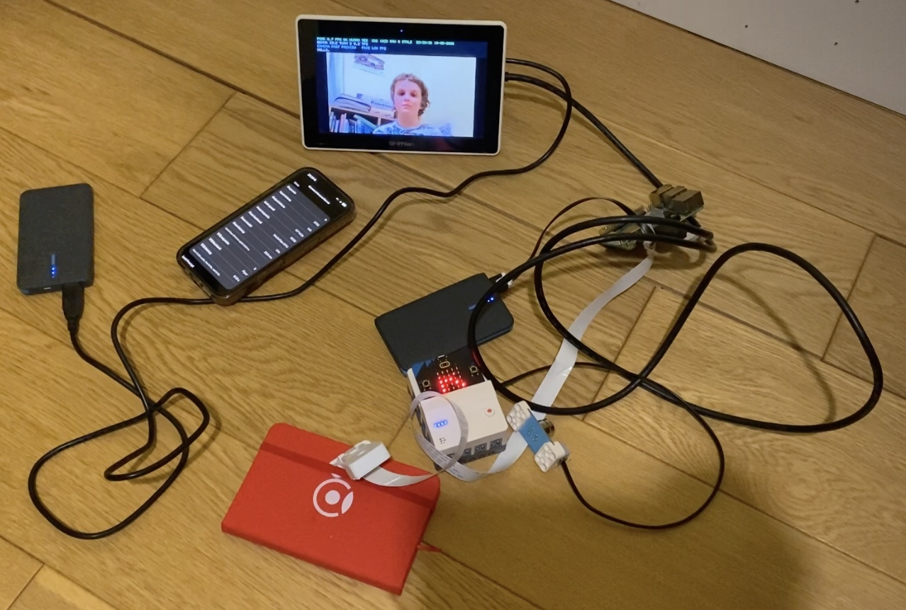
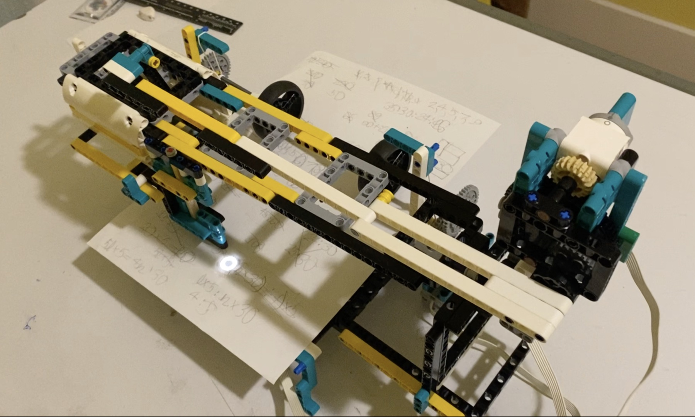
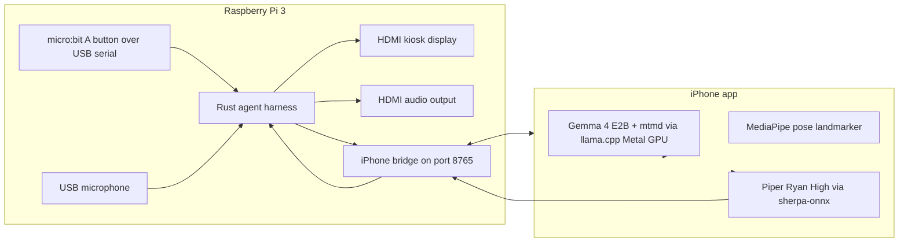
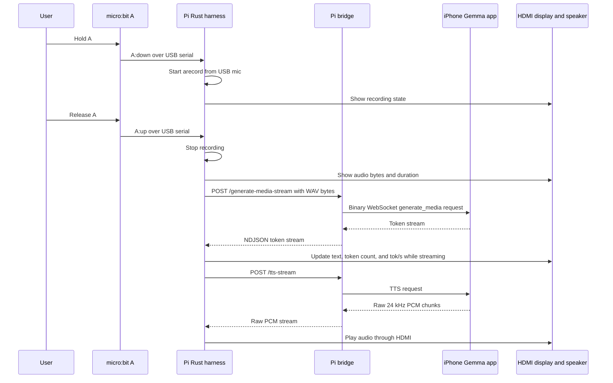

# Gemma4 Robot

Gemma4 Robot is a hardware project for the future of learning and healthy
habits. Its primary feature is a paper-based Science and Mathematics coach: the
system creates worksheets, writes them on paper with a pen plotter, reads the
student's handwritten work with a camera, uses Gemma 4 to grade the reasoning,
and writes feedback directly back onto the same paper. Its second feature is an
active sports coach that uses camera-based pose estimation to count exercises
such as squats, push-ups, and jumps.

The device is meant to be controlled naturally, without a keyboard. The user
talks to it through a microphone, shows work and movement through cameras, and
gets responses through the screen, audio, and marks written by the plotter. A
single physical button can be used for simple control.

## Project Photos

Raspberry Pi controller, iPhone Gemma worker, HDMI kiosk, LEGO hub, micro:bit,
and local wiring:



LEGO paper plotter prototype for writing tasks and feedback directly onto
student work:



This repository is an entry for the [Gemma 4 Good Hackathon](https://www.kaggle.com/competitions/gemma-4-good-hackathon).
Gemma 4 is the central brain of the system: it drives the assistant, turns
learning goals into tasks, reads student work from camera images, grades
reasoning, decides what feedback should be written back to paper, and supports
the physical-activity coach.

## Current Architecture

The Raspberry Pi 3 remains the hardware controller and kiosk, while the iPhone
does the heavy inference work. The Pi starts the local services at boot, opens a
bridge listener, records from the USB microphone, updates the HDMI kiosk,
and plays audio through HDMI. The iPhone app connects out to the Pi bridge,
loads Gemma 4 E2B with `llama.cpp` on Metal GPU, runs MediaPipe pose
estimation, and streams Piper TTS audio back to the Pi.



The Pi side is split into three long-running pieces:

- `gemma-voice-bot.service`: starts the Rust voice agent automatically at boot.
- `gemma-voice-kiosk.service`: starts the HDMI camera overlay automatically at boot.
- `iphone_llm_bridge.py`: starts from the `max` user's `@reboot` crontab and
  listens on `0.0.0.0:8765`.

The iPhone app cannot be auto-launched by the Pi after an iPhone reboot or app
kill. It must be running so it can connect back to the Pi bridge.

## Vision And Coaching Loop

The HDMI display is a direct framebuffer overlay, not Chrome or X. The kiosk
launcher runs `scripts/vision/pi_camera_pose_overlay.py`, which reads only the
CSI Pi camera through `rpicam-vid`, draws the live camera feed to `/dev/fb0`,
sends lower-rate RGB pose frames to the iPhone bridge, and draws returned
MediaPipe landmarks, Gemma text, pose FPS, and squat counts on top.

The Rust harness is configured with `agent-harness/prompts/fitness_coach.md` and
`agent-harness/config/fitness_coach_tools.json`. At startup it prompts Gemma to
call `wait_for_human`; that tool blocks on `~/gemma4-robot/kiosk/vision_state.json`
until a stable pose is visible. If the user asks for exercise coaching, Gemma
calls `squat_counter`, which writes `vision_command.json` and returns at the 2
and 4 rep milestones in the current home-demo configuration.

## Voice Loop

The current push-to-talk loop uses the micro:bit A button, not the removed
Google Voice HAT button.



Audio sent to Gemma is sent as a WAV media part to the iPhone bridge. It is not
transcribed first. The bridge uses a compact binary frame for media requests, so
recorded audio is not base64 encoded in the Pi-to-iPhone path.

## iPhone App

The iPhone app is under [`ios/GemmaPi/`](ios/GemmaPi/). Its source of truth is
[`ios/GemmaPi/project.yml`](ios/GemmaPi/project.yml) plus Swift files under
`ios/GemmaPi/GemmaPiApp/`; generated Xcode files are not committed.

Open the app in Xcode with:

```sh
ios/GemmaPi/scripts/open_xcode.sh
```

That script downloads the ignored local MediaPipe XCFramework artifacts,
regenerates `GemmaPi.xcodeproj`, and opens it in Xcode. MediaPipe pose
estimation is wired through a local SwiftPM binary package under
`ios/GemmaPi/LocalMediaPipe/`; the large Google artifacts are downloaded by
script and are not committed.

The app screen exposes:

- model download and delete controls,
- multimodal projector download and delete controls,
- GPU model load,
- Pi bridge connect and cancel controls,
- a model test prompt,
- a TTS model picker and voice field,
- a speaker button to play the last model-test response through iPhone
  Piper TTS,
- a hold-to-talk mic button that records a WAV on the iPhone and sends it to
  Gemma as an audio input,
- connection, token, pose, TTS, prompt, and generated-text stats.

CPU/GPU benchmark controls and llama benchmark code have been removed from the
app. The serving path is the proven `llama.cpp` Metal GPU path.

## Gemma4 Omni Fitness Model

This repo also includes `gemma4-omni-fitness/`, the audio-output training area
for a small Gemma4 omni fitness coach. The work trains Gemma-conditioned
audio-output heads that emit speech codec tokens, then decodes those tokens into
spoken coaching audio. The training and smoke experiments ran on Modal: the
larger audio-conditioned runs used H100 GPUs, while smaller codec,
projection-head, and packaging checks used L4 GPUs where that was enough.

The current trained omni model is a research prototype, not the deployed robot
voice path. It proves the Gemma-to-audio plumbing for narrow fitness-coaching
phrases and style controls, and the docs record where the current approach does
and does not generalize.

`gemma4-omni-fitness/dataset-browser/` is a local SvelteKit dataset browsing UI.
It loads dataset manifests from ignored `out/` directories, lets us filter by
split, transcript, style, voice, loudness, and review status, and streams sample
WAV files through a local `/audio` route for manual quality review.

Run it locally with:

```sh
cd gemma4-omni-fitness/dataset-browser
npm install
GEMMA4_OMNI_REPO_ROOT=/Users/yaroslavvolovich/projects/gemma4-robot npm run dev
```

## Pi Button Setup

Flash this MicroPython program to the micro:bit inserted in the Nezha Pro board:

```sh
python3 scripts/microbit/flash_microbit_via_pi.py scripts/microbit/microbit_a_button_serial.py
```

The program writes `A:down` when micro:bit button A is pressed and `A:up` when
it is released. The Rust harness reads those lines from `/dev/ttyACM*` or
`/dev/serial/by-id/*micro*` and records only while A is held.

## What It Does

The project has two main parts.

First, it is a science and mathematics learning coach. The system can create a
worksheet, write it on paper, let the student solve it by hand, photograph the
completed work, use Gemma 4 to grade the reasoning, and then write marks and
feedback directly onto the sheet. The point is to keep the best part of paper
learning: working things out by hand, while adding an intelligent coach that can
generate tasks, inspect reasoning, and respond immediately.

Second, it is an active sports coach. A camera watches the user and a custom
pose-estimation runtime detects body landmarks. The system can use those
landmarks to count squats, push-ups, jumps, and other exercises. This lets the
device count repetitions, notice whether the user is moving, and help make
exercise more regular.

Both parts are controlled through voice, camera, screen, audio, and a single
button, not a keyboard.

## Paper Learning Loop

The system is connected to a plotter: a printer-like mechanism that moves a pen
over paper.

That enables a paper workflow:

1. Gemma 4 creates a task for the student, such as a worksheet.
2. The plotter writes the worksheet on paper.
3. The student solves the task on that sheet.
4. A camera attached to the device takes a photo of the completed work.
5. Gemma 4 reads and grades the work.
6. The plotter writes marks and feedback directly onto the paper.

For example, Gemma 4 could create an Olympiad-style mathematics worksheet, such
as a UK Junior Mathematical Challenge practice question, let the student do the
working by hand, then grade the answer and mark the page.

This connects intellectual work to the physical world: the student writes on
paper, the device reads the work, and the pen plotter writes feedback back onto
the same page.

## Pose Estimation Runtime

The current low-level pose work lives in:

- [`pose_estimation/`](pose_estimation/)
- [`pose_estimation/REPORT.md`](pose_estimation/REPORT.md)

The pose runtime is a custom Raspberry Pi 3B+ NEON implementation of the
MediaPipe Pose Landmarker Lite computation. It is designed to be small and fast
on the Pi without linking TensorFlow Lite, LiteRT, MediaPipe, OpenCV, NumPy, or
XNNPACK into the deployed runtime.

The current best tracked-camera result on the Pi is about `113 ms` per frame,
or about `8.8 FPS`, after the detector has acquired the person. That is the
important steady-state mode for exercise counting.

## Project Direction

The project is meant to be a real local hardware assistant, not just a demo.
The core ideas are:

- paper-based learning tasks,
- camera-based grading,
- pen-plotter feedback directly on paper,
- Gemma 4 as the central learning coach and hardware-control brain,
- trained Gemma4 omni audio-model research for future low-latency coaching
  speech,
- microphone and camera input with screen, audio, and plotter output,
- local camera-based exercise counting.

Together, these make a system that coaches both intellectual work and physical
activity.
