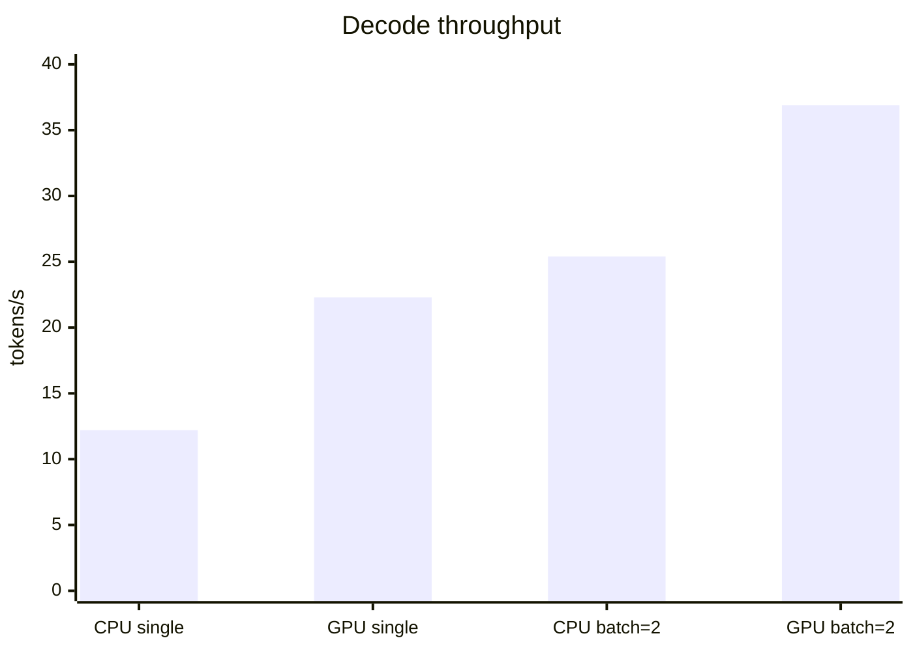
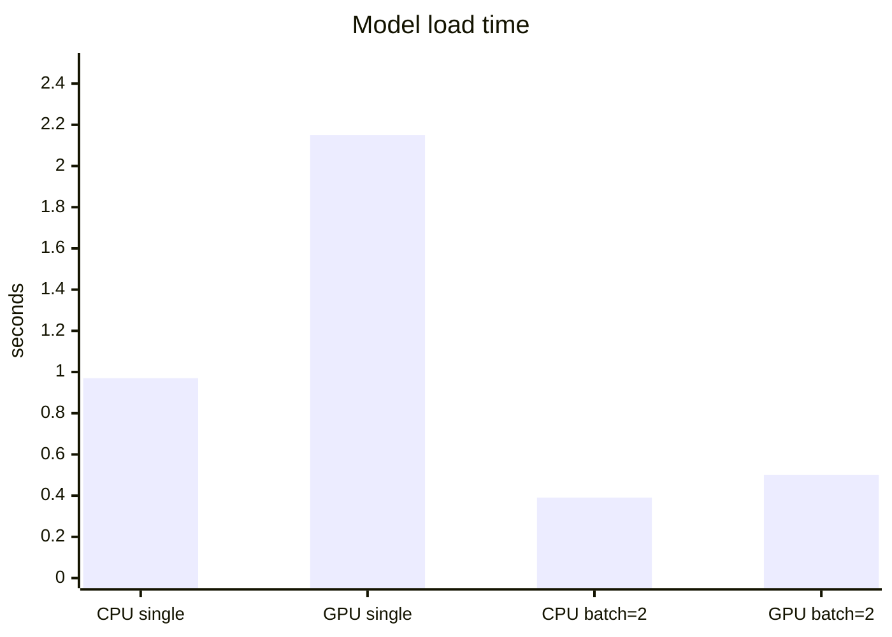
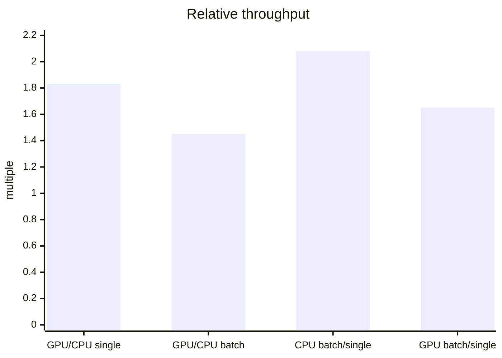
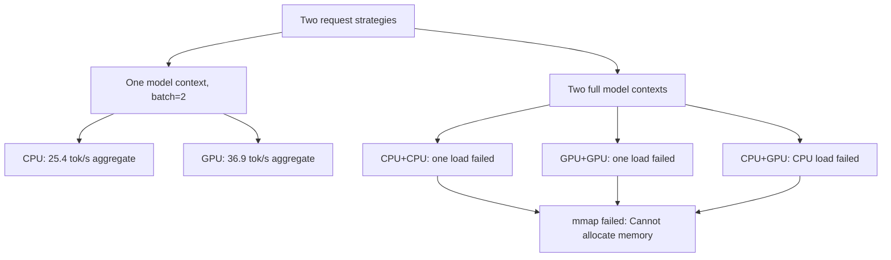
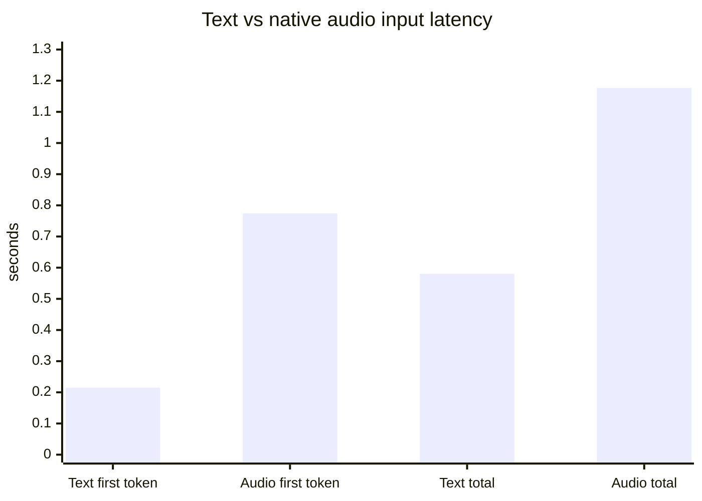

# iPhone llama.cpp Benchmark Report

Date: 2026-05-16, updated 2026-05-17

## Setup

- Device: iPhone 16 Pro, iOS 26.4.2
- App: Gemma Inference Server, installed with Xcode command-line tooling
- Runtime: `llama.cpp` linked as `llama.framework`
- Backend modes tested: CPU and Metal GPU
- Model: `gemma-4-E2B-it-Q4_K_M.gguf`
- Model size on device: 2.89 GB
- Prompt: `hi`
- Generation cap: 32 tokens
- Source log: `/tmp/gemmapi-llama-bench-expanded.log` on the Mac that ran the device benchmark

## Summary

Metal GPU is the right default serving path for the iPhone app. It is faster than CPU for single-request decode and for `batch=2`. Two full model contexts do not fit reliably on the device with this GGUF: CPU+CPU, GPU+GPU, and CPU+GPU concurrent two-copy runs all failed one of the two model loads with `mmap failed: Cannot allocate memory`.

For two simultaneous requests, use one loaded GPU model with `batch=2`, not two model copies.

## Results

| Run | Backend | Load time | Output tokens | Decode throughput | Outcome |
| --- | --- | ---: | ---: | ---: | --- |
| Single | CPU | 0.97 s | 10 | 12.2 tok/s | OK |
| Single | GPU / Metal | 2.15 s | 10 | 22.3 tok/s | OK |
| Batch=2 | CPU | 0.39 s | 20 | 25.4 tok/s | OK |
| Batch=2 | GPU / Metal | 0.50 s | 20 | 36.9 tok/s | OK |
| Concurrent x2 | CPU #1 | - | 0 | 0.0 tok/s | Failed: memory allocation |
| Concurrent x2 | CPU #2 | 0.43 s | 10 | 12.7 tok/s | OK |
| Concurrent x2 | GPU #1 | 0.50 s | 10 | 23.0 tok/s | OK |
| Concurrent x2 | GPU #2 | - | 0 | 0.0 tok/s | Failed: memory allocation |
| CPU+GPU concurrent | CPU | - | 0 | 0.0 tok/s | Failed: memory allocation |
| CPU+GPU concurrent | GPU / Metal | 0.49 s | 10 | 21.7 tok/s | OK |

## Decode Throughput

## Load Time

## Relative Throughput

| Comparison | Result |
| --- | ---: |
| GPU single vs CPU single | 1.83x |
| GPU batch=2 vs CPU batch=2 | 1.45x |
| CPU batch=2 aggregate vs CPU single | 2.08x |
| GPU batch=2 aggregate vs GPU single | 1.65x |

## Concurrency Findings

## Decision

Use `llama.cpp` on Metal GPU as the app default:

- Default app serving backend: GPU / Metal.
- Keep CPU available only in the benchmark harness and as a low-level fallback path.
- Do not try to increase capacity by loading CPU and GPU copies simultaneously.
- For two active requests, batch them through one loaded GPU context.

## Notes

The `concurrent x2` ordering is race-dependent. In this run one context loaded and the other failed. The stable finding is not which numbered context won the race, but that two full contexts did not fit together.

## Native Audio Input Smoke Test

Date: 2026-05-17

Setup:

- Device: iPhone 16 Pro, iOS 26.4.2
- Runtime: `llama.cpp` Metal GPU plus `libmtmd`
- Model: `gemma-4-E2B-it-Q4_K_M.gguf`
- Projector: `mmproj-F16.gguf`
- Test audio: generated WAV saying `hello, my name is Max`
- Audio file: 4.65 s mono WAV, 223,244 bytes, generated under ignored `out/audio-input-benchmark/`
- Prompt instruction: do not use emojis

Result: native Gemma audio input worked. The model heard the name and replied with text containing `Max`. No Apple speech-to-text path was used.

| Input | Runs | Mean first token | Mean total wall | Mean speed | Output |
| --- | ---: | ---: | ---: | ---: | --- |
| Text | 5 | 0.215 s | 0.580 s | 18.1 tok/s | `Hello Max, it is nice to meet you.` |
| Audio WAV | 5 | 0.774 s | 1.177 s | 10.7 tok/s | `Hello Max, it was nice to hear from you.` |

Audio overhead for this 4.65 s spoken phrase:

- First token: +0.560 s
- Total wall time: +0.597 s
- Total wall time ratio: 2.03x text-only

The app-side mtmd instrumentation showed the 223,244 byte WAV decoded to 74,400 float samples. The native mtmd prefill/eval stage took about 0.50 s in the follow-up smoke run, which accounts for most of the measured audio overhead.

## Recorded Audio Crash Fix

The iPhone crash reported after pressing Hold to Talk was not in the Gemma projector. The copied device crash report `GemmaPi-2026-05-17-182442.ips` showed:

- Exception: `EXC_BAD_ACCESS`
- Faulting thread: `AudioRecorderAQInputCallback`
- Main thread: `PiBridgeClient.stopAudioCapture()` called from `PiBridgeClient.startAudioCapture()`

The fix keeps stopped `AVAudioRecorder` instances retained briefly after `stop()` and delays audio-session deactivation so AudioQueue callbacks can drain before the recorder is released.

Post-fix validation on the physical iPhone:

- Build succeeded.
- Text bridge request succeeded.
- Generated WAV native audio request succeeded twice.
- Launch arg `--audio-recording-smoke` recorded a 1.283 s WAV through the iPhone microphone path, decoded it through mtmd as audio, generated a Gemma response, released the recorder after callback drain, and produced no new crash report.
