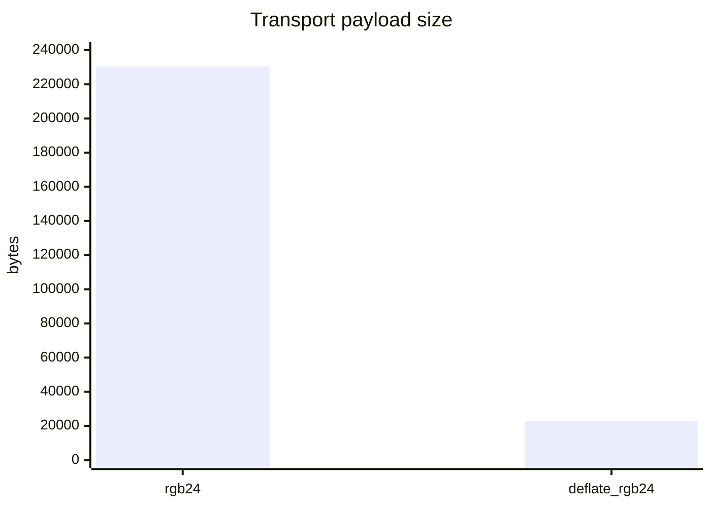
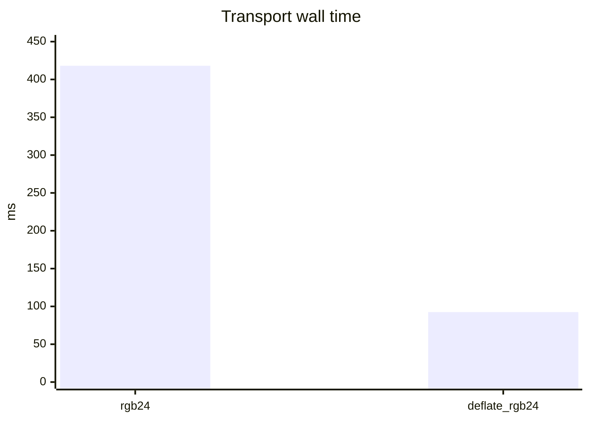
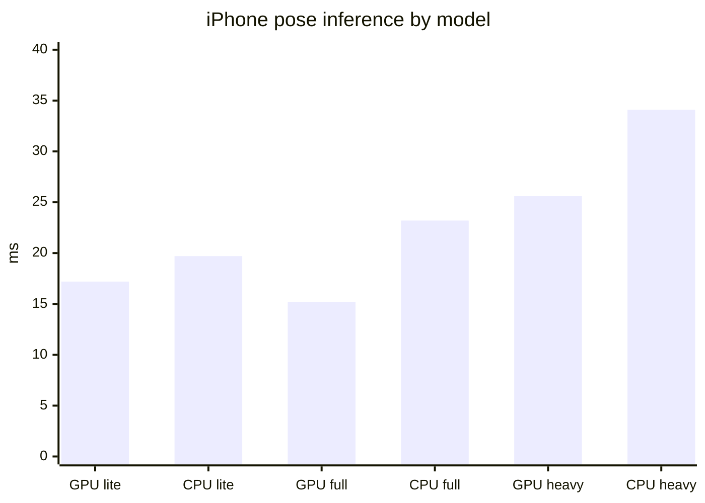
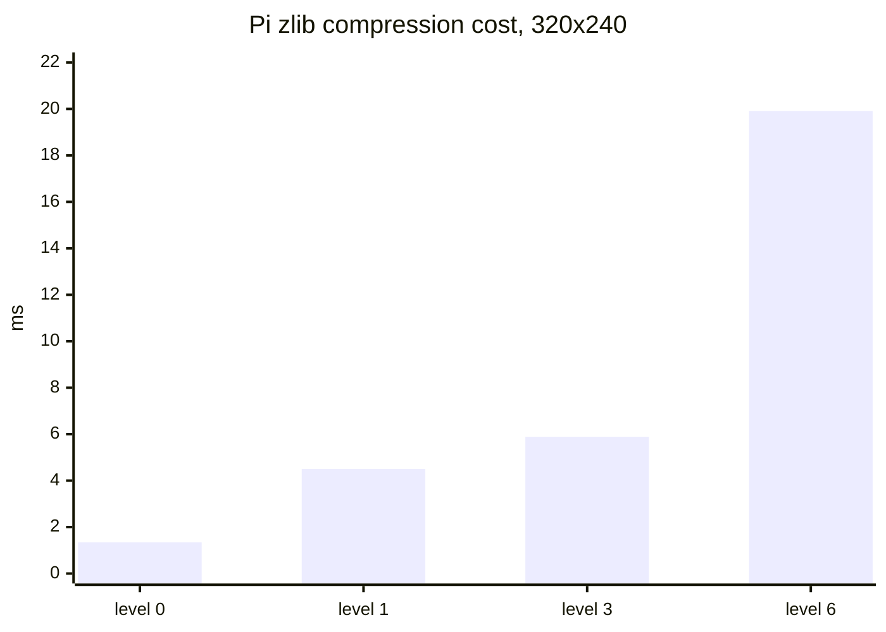

# iPhone Pose Offload Benchmark Report

Date: 2026-05-17

## Setup

- Pi: Raspberry Pi 3, bridge at `http://127.0.0.1:8765` on the Pi.
- iPhone bridge path: direct LAN WebSocket, `ws://192.168.1.174:8765/worker`.
- Observed iPhone LAN peer: `192.168.1.72`.
- Fallback discovery/control path: Tailscale. The app data path no longer needs Tailscale when LAN routing is available.
- iPhone pose runtime: MediaPipe Pose Landmarker, `lite`, `full`, and `heavy` `.task` models downloaded into app storage.
- Frame endpoint: `POST /pose-frame` with binary body. No base64 is used for this path.

## Decision

Use a binary deflated frame at the camera output size as the current Pi-to-iPhone pose format. For RGB still-frame paths, use `deflate_rgb24`. For live `rpicam-vid` preview, use `deflate_yuv420` because the camera already emits YUV420.

Reasons:

- It preserves pose detection on the current 320x240 frame.
- It reduced the measured payload from 230400 bytes to 22764 bytes.
- It added about 5 ms of Pi CPU time.
- It reduced median HTTP wall time from 418 ms to 92 ms over the measured bridge path.
- It avoids the base64 expansion and chunking cost from the earlier JSON path.

Do not use the current pure-Python resize or RGB-to-YUV conversion on the Pi for real-time work. Those paths are too slow on Pi 3. If downsampling is needed, request the target size directly from `rpicam-*` or add an optimized native scaler.

`scripts/voice-kit/pose_preview_mode.py` now defaults to the iPhone pose engine and sends `deflate_yuv420` frames to `/pose-frame`. That is the right live-camera format because `rpicam-vid` already emits YUV420, so the Pi only deflates the frame instead of converting it to RGB first.

## Current 320x240 Transport

Measured on the current `kiosk/exercise_frame.rgb`, 3 measured runs after 1 warmup, iPhone GPU lite model.

| Variant | Bytes | Pi prep ms | HTTP wall ms | iPhone decode ms | Inference ms | iPhone total ms | Presence |
| --- | ---: | ---: | ---: | ---: | ---: | ---: | ---: |
| `rgb24-320x240` | 230400 | 0.0 | 418.1 | 5.3 | 18.9 | 24.2 | 0.999 |
| `deflate_rgb24-320x240` | 22764 | 4.9 | 92.5 | 6.1 | 17.2 | 23.4 | 0.999 |

## iPhone Pose Model Quality

All rows use `deflate_rgb24-320x240` on the same current frame.

| Backend | Model | HTTP wall ms | iPhone total ms | Inference ms | Presence |
| --- | --- | ---: | ---: | ---: | ---: |
| GPU | lite | 92.5 | 23.4 | 17.2 | 0.999 |
| CPU | lite | 81.5 | 21.8 | 19.7 | 0.999 |
| GPU | full | 68.3 | 17.2 | 15.2 | 0.991 |
| CPU | full | 104.3 | 25.2 | 23.2 | 0.984 |
| GPU | heavy | 108.6 | 29.1 | 25.6 | 1.000 |
| CPU | heavy | 113.7 | 36.0 | 34.1 | 1.000 |

The short run says GPU `full` is the best current default candidate for pose: it was faster than `lite` in this sample and still gave strong presence. GPU `heavy` is viable but costs more inference time.

## Larger Human Frame

Measured from `out/human-for-pose.rgb` at 514x994, iPhone GPU lite model.

| Variant | Bytes | Pi prep ms | HTTP wall ms | iPhone total ms | Presence |
| --- | ---: | ---: | ---: | ---: | ---: |
| `deflate_rgb24-514x994` | 453269 | 68.0 | 1264.2 | 316.1 | 1.000 |
| `deflate_rgb24-320x618` | 197516 | 618.5 | 427.8 | 16.8 | 1.000 |

The downsampled frame proves quality can survive smaller frames, but the current downsample implementation is pure Python and costs 618 ms. For real time, downsample in the camera pipeline or native code, not Python.

## Pi Compression Levels

Raw deflate, Python stdlib zlib, median of 6 local Pi runs.

| Frame | Raw bytes | Level | Compressed bytes | Ratio | Pi ms |
| --- | ---: | ---: | ---: | ---: | ---: |
| `kiosk/exercise_frame.rgb` | 230400 | 0 | 230425 | 1.000 | 1.34 |
| `kiosk/exercise_frame.rgb` | 230400 | 1 | 22764 | 0.099 | 4.50 |
| `kiosk/exercise_frame.rgb` | 230400 | 3 | 20233 | 0.088 | 5.89 |
| `kiosk/exercise_frame.rgb` | 230400 | 6 | 18583 | 0.081 | 19.91 |
| `out/human-for-pose.rgb` | 1532748 | 0 | 1532873 | 1.000 | 9.25 |
| `out/human-for-pose.rgb` | 1532748 | 1 | 453269 | 0.296 | 66.00 |
| `out/human-for-pose.rgb` | 1532748 | 3 | 429065 | 0.280 | 77.08 |
| `out/human-for-pose.rgb` | 1532748 | 6 | 408994 | 0.267 | 152.29 |

Level 1 is the right default. Level 3 saves little extra bandwidth. Level 6 is too expensive for real-time Pi 3 use.

## Open Work

- Request the final target resolution from the camera pipeline directly, or add a small native/NEON scaler if camera-side sizing is not enough.
- Use GPU `full` as the first higher-quality iPhone pose default, then keep `lite` as fallback if thermal or battery behavior becomes a problem.
- Re-run with live camera capture once `rpicam-*` sees the camera again. The last live check had `no cameras available`, so these are file-based frame benchmarks.
