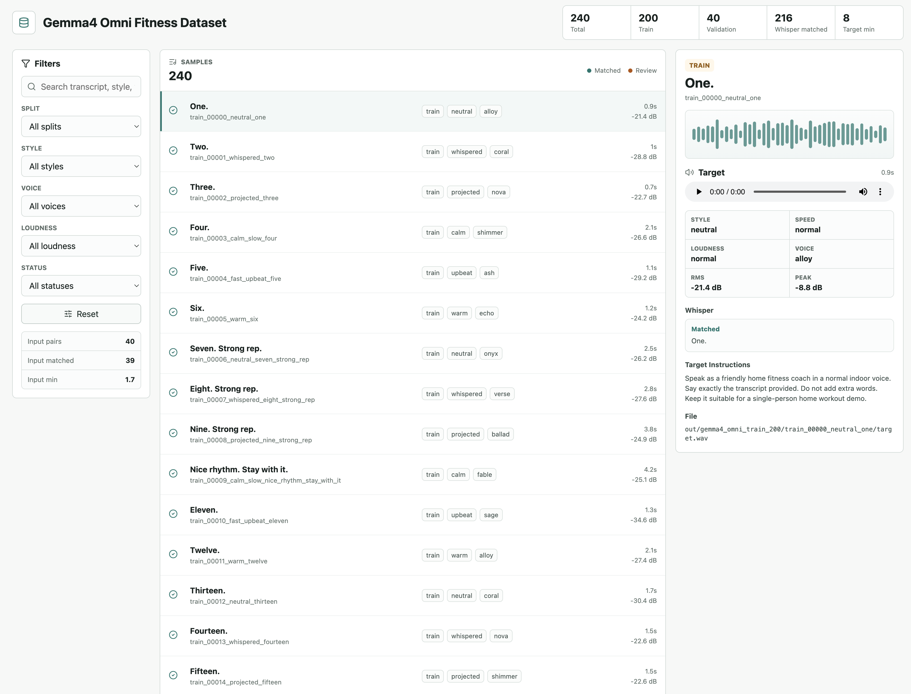

# Gemma4 Omni Dataset Browser

Local SvelteKit UI for reviewing Gemma4 omni fitness voice examples before they
are used for training.

The browser reads dataset summaries from the parent repo, renders filterable
sample rows, and serves WAV files from the ignored `out/` tree through a local
`/audio` route. It is intended for manual quality review, not for publishing the
audio data.



## Run

```sh
cd gemma4-omni-fitness/dataset-browser
npm install
GEMMA4_OMNI_REPO_ROOT=/Users/yaroslavvolovich/projects/gemma4-robot npm run dev
```

Open the Vite URL printed by the dev server.

## Expected Data

By default the app reads:

```text
out/gemma4_omni_train_200/summary.json
out/gemma4_omni_validation_40/summary.json
```

Those files and the corresponding WAVs are local artifacts under `out/` and are
not committed to this repository.

## Review Surface

The UI exposes:

- train vs validation split,
- transcript/search filtering,
- style, voice, loudness, and review-status filters,
- input and target audio playback when present,
- transcript match status,
- duration, RMS, peak, sample rate, source model, and file path metadata.

The next training run should only consume examples that pass transcript checks
and manual listening review.
