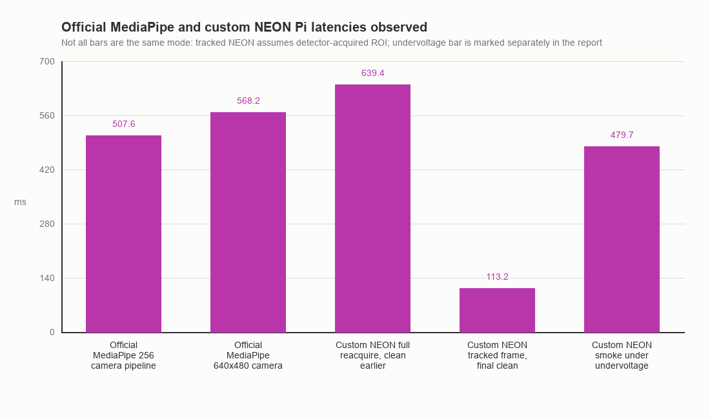
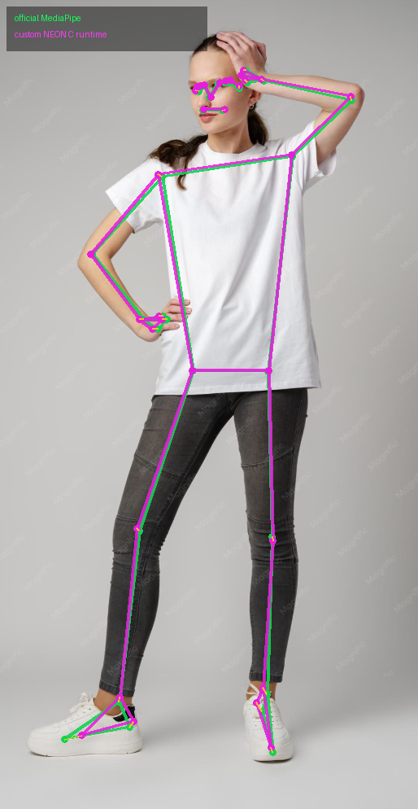
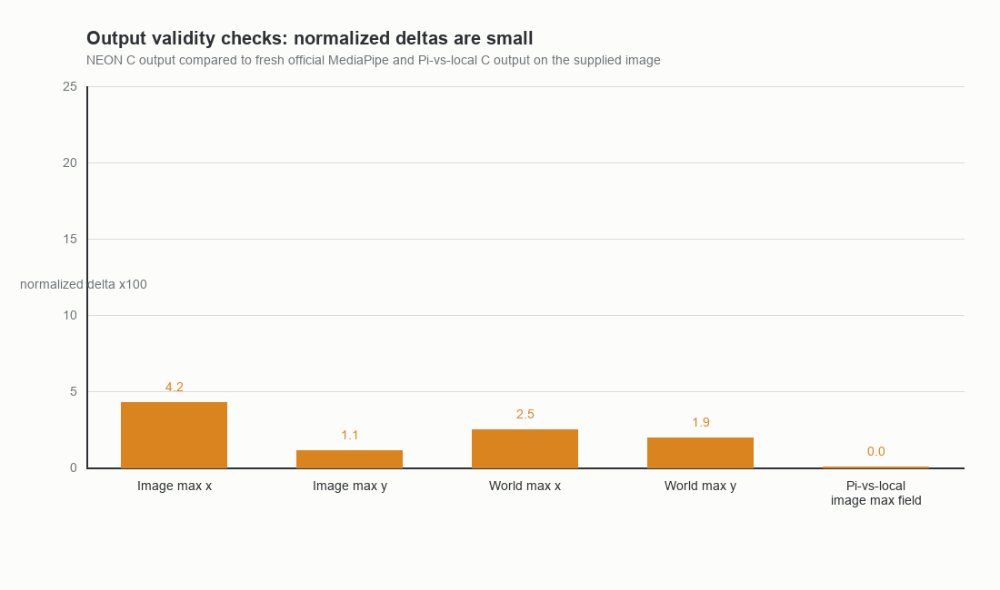
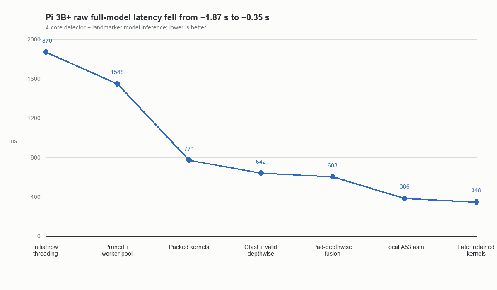
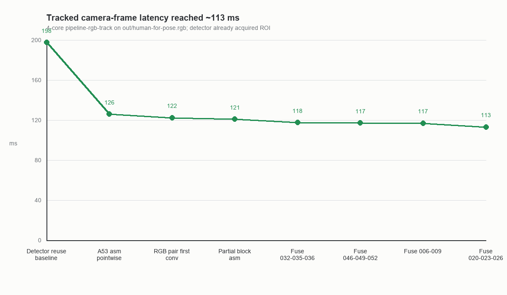
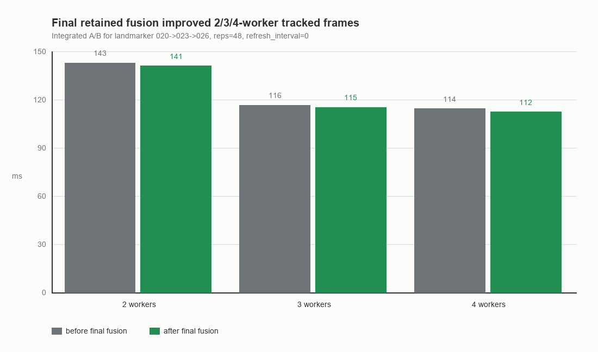

# Raspberry Pi 3B+ NEON Pose Runtime Report

Date: 2026-05-16

This report summarizes the current custom NEON pose runtime for Raspberry Pi
3B+. The target is the same pose-estimation computation as the official
MediaPipe Pose Landmarker Lite task, but implemented as a small fixed-graph
runtime instead of linking TensorFlow Lite, LiteRT, MediaPipe, OpenCV, NumPy, or
XNNPACK into the deployed runtime.

The current direction is NEON-only. The earlier GLES2 GPU path has been dropped
from the implementation plan.

## Result Summary

The custom runtime now runs the detector, ROI generation, ROI sampling,
landmarker, heatmap refinement, projection, world-landmark rotation, and JSON
export from raw RGB input.

Best retained Pi 3B+ camera-style tracked-frame result:

| Mode | Workers | Latency | FPS | Notes |
| --- | ---: | ---: | ---: | --- |
| Tracked frame, detector already acquired ROI | 4 | 113.171 ms | 8.836 | Best retained 4-worker smoke on `out/human-for-pose.rgb` |
| Tracked frame, final fusion A/B | 2 | 140.934 ms | 7.096 | `020->023->026`, `reps=48`, no refresh |
| Tracked frame, final fusion A/B | 3 | 115.211 ms | 8.680 | `020->023->026`, `reps=48`, no refresh |
| Tracked frame, final fusion A/B | 4 | 112.300 ms | 8.905 | `020->023->026`, `reps=48`, no refresh |
| Latest one-shot smoke after camera reconnect | 4 | 479.743 ms | 2.084 | Not representative: Pi reported `throttled=0x50005`, ARM clock about 600 MHz |

Official MediaPipe CPU/XNNPACK measurements observed earlier on the same Pi:

| Official path | FPS | Approx latency |
| --- | ---: | ---: |
| Synthetic 256x256 | 1.99 | 503 ms |
| Camera 256x256 YUV420 inference only | 2.05 | 488 ms |
| Camera 256x256 YUV420 pipeline | 1.97 | 508 ms |
| Camera 640x480 YUV420 inference only | 1.99 | 503 ms |
| Camera 640x480 YUV420 pipeline | 1.76 | 568 ms |

These official measurements and the custom tracked-frame measurements are not
identical modes: the custom fast path assumes a detector-acquired ROI and then
updates the ROI from landmarks. For exercise counting this is the intended
steady-state path: acquire or reacquire with the detector, then run tracked
landmarker frames until confidence/geometry says to reacquire.



## Output Validity

The supplied validation image is `out/human-for-pose.png`. Since `out/` is
ignored, the visual comparison artifact is tracked here:



Overlay convention:

- Green: fresh official MediaPipe Pose Landmarker output.
- Magenta: custom NEON C runtime output.
- Yellow lines: visible disagreement vectors for points separated by at least 3
  pixels.

Visual assessment: the skeletons overlap closely on the torso, arms, hips,
knees, and most face/hand points. The visible mismatch is concentrated around
feet/toes and a few small extremity points. For squat-counting geometry, the
hip/knee/ankle/torso landmarks are good enough to continue runtime integration.

Fresh official MediaPipe command:

```sh
uv run --isolated --with mediapipe --with pillow --with numpy \
  python scripts/pose_official_image_ref.py \
  /tmp/pose_landmarker_lite.task \
  out/human-for-pose.png \
  out/human-for-pose-official-mediapipe-fresh.json
```

Official output:

```text
poses=1
image_shape=[994, 514, 3]
```

Custom C runtime command:

```sh
/tmp/pose_runtime_clean_local pipeline-rgb \
  out/pose_runtime_data \
  out/human-for-pose.rgb \
  514 994 \
  out/human-for-pose-neon-clean-c.json \
  4 1
```

Custom output:

```text
pose_count=1
detector_avg_ms=8.096
landmarker_avg_ms=4.063
frame_avg_ms=12.762
fps=78.358
```

Those timing numbers are from the Mac local build and are only a local
correctness smoke, not Pi performance.

Landmark comparison against fresh official MediaPipe:

| Output | Max abs x | Max abs y | Max abs z | Mean abs x | Mean abs y | Mean abs z |
| --- | ---: | ---: | ---: | ---: | ---: | ---: |
| Image landmarks | 0.042309 | 0.010982 | 0.271221 | 0.006461 | 0.002579 | 0.100677 |
| World landmarks | 0.024660 | 0.019199 | 0.073989 | 0.010729 | 0.007015 | 0.024695 |

Largest 2D image-space outliers on the supplied photo:

| Landmark | Pixel distance | dx | dy |
| --- | ---: | ---: | ---: |
| right_foot_index | 22.30 px | 21.75 | -4.95 |
| left_heel | 13.31 px | -7.62 | -10.92 |
| left_ankle | 9.42 px | -4.36 | -8.35 |
| right_heel | 8.83 px | 4.76 | -7.43 |
| right_pinky | 7.23 px | -7.21 | -0.55 |

Pi binary output compared against the local C output:

| Check | Max landmark-field delta |
| --- | ---: |
| Image landmarks, Pi vs local C | 8.225e-6 |
| World landmarks, Pi vs local C | 3.606e-6 |

Raw model tensor checks against LiteRT reference stayed in the expected range
through retained changes:

| Model | Tensor | Max abs error |
| --- | --- | ---: |
| detector | 441, boxes/keypoints | 5.264e-4 |
| detector | 429, scores | 3.357e-4 |
| landmarker | 310, landmarks | 8.278e-3 |
| landmarker | 315, presence | 2.86e-14 |
| landmarker | 283, heatmap | 5.188e-4 |
| landmarker | 312, world landmarks | 1.359e-5 |



## Optimization Method

The implementation work was bottom-up. The runtime started as a direct fixed
graph executor, then replaced the real bottlenecks with model-specialized
kernels only after comparing outputs against the current scalar/direct executor
and against reference outputs.

The important design choices were taken from XNNPACK's Cortex-A53 strategy, but
implemented locally:

1. Extract the official model into static C plans and raw constant blobs.
2. Prune segmentation output because the exercise counter needs pose landmarks,
   not masks.
3. Create a persistent worker pool once and tile work over output pixels and
   output-channel blocks.
4. Pack 1x1 pointwise weights once into output-channel blocks of 8.
5. Use a 6-output-pixel by 8-output-channel Cortex-A53 FP32 NEON FMA
   microkernel with fused min/max activation.
6. Specialize the first RGB stride-2 convolution and common depthwise shapes.
7. Fuse fixed graph chains when correctness was proven and integrated latency
   improved, not just when one isolated op looked faster.

The retained low-level source is now in:

- `pose_estimation/pose_runtime.c`
- `pose_estimation/a53_pw6x8.S`

The XNNPACK comparison/reference material is now under:

- `pose_estimation/research/benchmarks/vs_xnnpack/`

That directory explains how to build upstream XNNPACK benchmarks for comparison.
The production runtime does not link XNNPACK.

## Latency Progression

Raw full-model 4-core latency improved from roughly 1.87 s for the first direct
executor to roughly 0.35 s after retained kernel work. Raw full-model timing is
detector plus landmarker model inference; it is useful for kernel work, but it
is not the best camera operating mode.



Key raw full-model checkpoints:

| Checkpoint | 4-core latency | Notes |
| --- | ---: | --- |
| Initial row-threaded direct executor | 1870 ms | Correct but too slow |
| Segmentation pruning, packed landmarker pointwise, persistent pool | 1548 ms | First major graph/runtime cleanup |
| Packed pointwise, first-conv, fast SAME depthwise, parallel PAD | 771 ms | XNNPACK-style scheduling begins paying off |
| `-Ofast` plus valid depthwise | 642 ms | Faster build flags and padded depthwise handling |
| Safe PAD->DEPTHWISE fusion | 603 ms | Avoids materializing some padded intermediates |
| Local A53 6x8 pointwise assembly | 386 ms | Captures much of XNNPACK calibration win |
| Later retained kernels | about 348 ms | RGB-pair, partial-block assembly, later graph fusions |

Tracked camera-frame latency is the important steady-state number for a squat
counter. In that mode, the detector has acquired an ROI, then subsequent frames
run ROI sampling, landmarker, projection, and rect update.



Retained tracked-frame checkpoints:

| Checkpoint | 4-core tracked latency | FPS | Notes |
| --- | ---: | ---: | --- |
| Detector-reuse baseline | 197.5 ms | 5.06 | Repeated `pipeline-rgb-rect`, same rect |
| Local A53 pointwise assembly | 125.9 ms | 7.95 | Replaced hot pointwise tiles with local 6x8 asm |
| RGB-pair first conv | 122.4 ms | 8.17 | Two-output first RGB stride-2 kernel |
| Partial-block assembly | 121.0 ms | 8.26 | Use A53 asm tail stores for partial pointwise blocks |
| Fuse `032->035->036` | 117.6 ms | 8.50 | Depthwise -> pointwise -> residual add |
| Fuse `046->049->052` | 117.1 ms | 8.54 | PAD -> depthwise -> pointwise |
| Fuse `006->009` | 117.0 ms | 8.55 | Depthwise -> pointwise |
| Fuse `020->023->026` | 113.2 ms | 8.84 | PAD -> depthwise -> pointwise |

Final retained fusion A/B by worker count:



| Workers | Before final fusion | After final fusion | Delta |
| ---: | ---: | ---: | ---: |
| 2 | 142.818 ms | 140.934 ms | -1.884 ms |
| 3 | 116.478 ms | 115.211 ms | -1.267 ms |
| 4 | 114.368 ms | 112.300 ms | -2.068 ms |

## Retained Optimizations

Retained changes were required to pass both correctness checks and integrated
latency checks.

| Area | Retained change | Why it helped |
| --- | --- | --- |
| Graph extraction | Static model plans and constant blobs | Removes general TFLite interpreter overhead |
| Output pruning | Drop segmentation path | Fewer landmarker ops; pose counter only needs landmarks |
| Threading | Persistent worker pool | Avoids `pthread_create` per op |
| 1x1 pointwise | Packed weights, output-channel blocks of 8 | Turns NHWC pointwise conv into tiled GEMM-style compute |
| A53 pointwise | Local 6x8 FP32 NEON FMA microkernel | Matches the Cortex-A53 scheduling that XNNPACK uses |
| Activation | Fused min/max in kernels | Avoids extra passes over tensors |
| Depthwise | Fixed-shape 3x3/5x5 kernels, no inner boundary checks on interior pixels | Reduces branch and memory overhead |
| First conv | Specialized RGB stride-2 kernels | Avoids generic convolution overhead on fixed input shape |
| Graph fusion | `DEPTHWISE->CONV2D`, `DEPTHWISE->CONV2D->ADD`, `PAD->DEPTHWISE->CONV2D` | Avoids materialized intermediates and extra worker dispatches |
| Tracking | Detector acquire/reacquire plus landmarker steady state | Makes camera use practical by avoiding detector every frame |

## Rejected Experiments

Several correct experiments were reverted because they did not improve the
integrated tracked path reliably:

| Experiment | Reason rejected |
| --- | --- |
| Parallel ADD | Worker-dispatch overhead exceeded compute savings |
| 4x8 pointwise tile as default | Slower than 6x8 on Pi for this build/runtime |
| Direct residual-add assembly | Correct, but not a stable 2/3/4-worker tracked win |
| Branch-hoisted PAD->DEPTHWISE interior helper | Helped some isolated samples, regressed integrated 4-worker path |
| Sampler row-span optimization | Tiny crop differences were amplified by tracker feedback |
| Small-K pointwise specialization for op 012 | Isolated op improved, tracked frame did not |
| 5x5 `058->061->062` scratch fusions | Correct, but 2/3/4-worker timings were not consistently better |
| Detector op 204 schedule narrowing | Improved isolated op, not full detector or tracked path |

## Repro Commands

Build local correctness binary:

```sh
cc -O3 -std=c11 -Wall -Wextra \
  -I out/pose_runtime_data \
  pose_estimation/pose_runtime.c \
  -o /tmp/pose_runtime_clean_local \
  -lm -pthread
```

Build Pi AArch64 binary:

```sh
scripts/build_pose_runtime_aarch64.sh out/pose_neon_runtime_aarch64_ofast
```

Run the custom runtime on the supplied RGB sample:

```sh
/tmp/pose_runtime_clean_local pipeline-rgb \
  out/pose_runtime_data \
  out/human-for-pose.rgb \
  514 994 \
  out/human-for-pose-neon-clean-c.json \
  4 1
```

Run fresh official MediaPipe output for comparison:

```sh
uv run --isolated --with mediapipe --with pillow --with numpy \
  python scripts/pose_official_image_ref.py \
  /tmp/pose_landmarker_lite.task \
  out/human-for-pose.png \
  out/human-for-pose-official-mediapipe-fresh.json
```

Run the Pi smoke test:

```sh
ssh max@192.168.1.174 \
  'cd ~/gemma4-robot && ./out/pose_neon_runtime_aarch64_ofast \
    pipeline-rgb out/pose_runtime_data out/human-for-pose.rgb \
    514 994 /tmp/human-for-pose-neon-moved-pi.json 4 1'
```

Always record Pi power state with:

```sh
vcgencmd get_throttled
vcgencmd measure_clock arm
```

The latest smoke reported `throttled=0x50005` and about 600 MHz, so that timing
should not be used as the best-achieved runtime.
